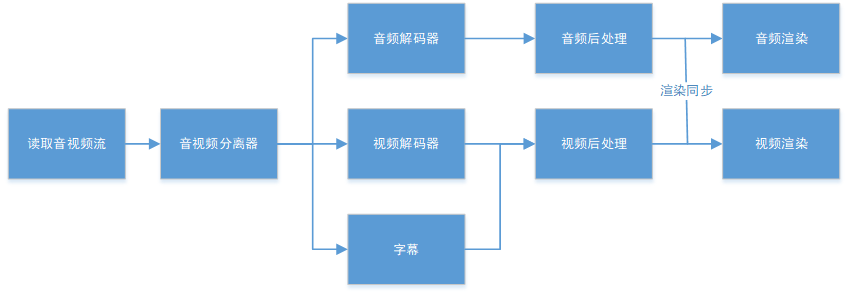
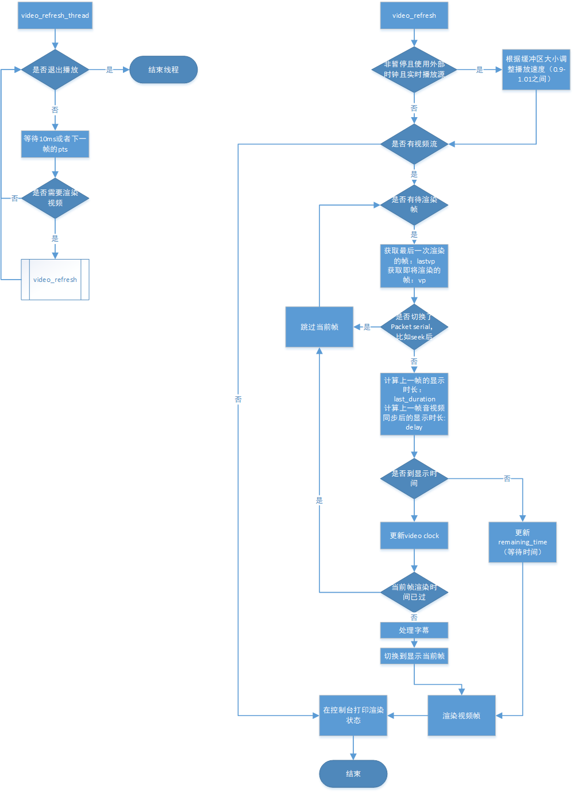

ijkplayer是B站开源的基于ffplay的移动端播放器SDK，2013年6月开源，活跃到2017年底，之后几乎停滞了。ijkplayer使用的ffmpeg4.0，版本已经很老了。如果想在生产环境使用ijkplayer，起码要升级到6.0，还是要下一番功夫的。

## 播放主流程

按照一般播放器设计，主流程几乎都是下面这样的：

为了效率，这个流程有几个地方可以简化：

1. 读取音视频和音视频分离器可以合并，这也是大多数播放器的做法
2. 音视频后处理可以集成到音视频渲染器上。顺便提一下，在Windows平台有个著名的视频后处理器VSFilter负责处理字幕
3. 字幕可以直接连接到视频后处理或者视频渲染器上

## 关于线程和缓冲区

播放器必须是个多线程应用。多线程的目的是为了提前填充缓冲区，为了音视频渲染的流畅性。

### 视频渲染器

视频渲染器管理当前正在渲染的帧以及待渲染帧，ijkplayer中视频的待渲染缓存区是`VideoState ::pictq`。待渲染帧就是缓存，除了保证渲染的流畅性，缓存还起到重排序B帧的作用。虽然有些解码器已经把视频帧按照pts排序后，推给视频渲染器，但是为了适应各种不同的解码器，视频解码器不能假设已经排好序了，另外待渲染帧通常使用环形队列实现，并且已经是排好序的，可以从后向前搜索新桢的插入位置，如果没有B帧，搜索一帧就确定了插入位置，最大搜索数量就是B帧的参考帧数量。考虑到播放流畅性和内存占用，目前待渲染帧比较合理的区间是4-10帧。ijkplayer的默认大小是3帧。当缓冲区已满时，一般会阻塞解码线程。

视频渲染器一般有独立的渲染线程，如果操作系统支持线程优先级，需要把渲染线程设置为最高优先级。ijkplayer中的渲染线程函数是 `video_refresh_thread`。ijkplayer的渲染线程最大10ms执行一次渲染任务，包括字幕渲染。渲染线程主要等待两个事件：

1. 播放器退出信号：收到该事件后，退出渲染线程
2. 下一帧渲染时间已到：替换当前渲染帧，立即渲染一次

渲染线程流程图如下：

参考：
1. https://zhuanlan.zhihu.com/p/43564980
